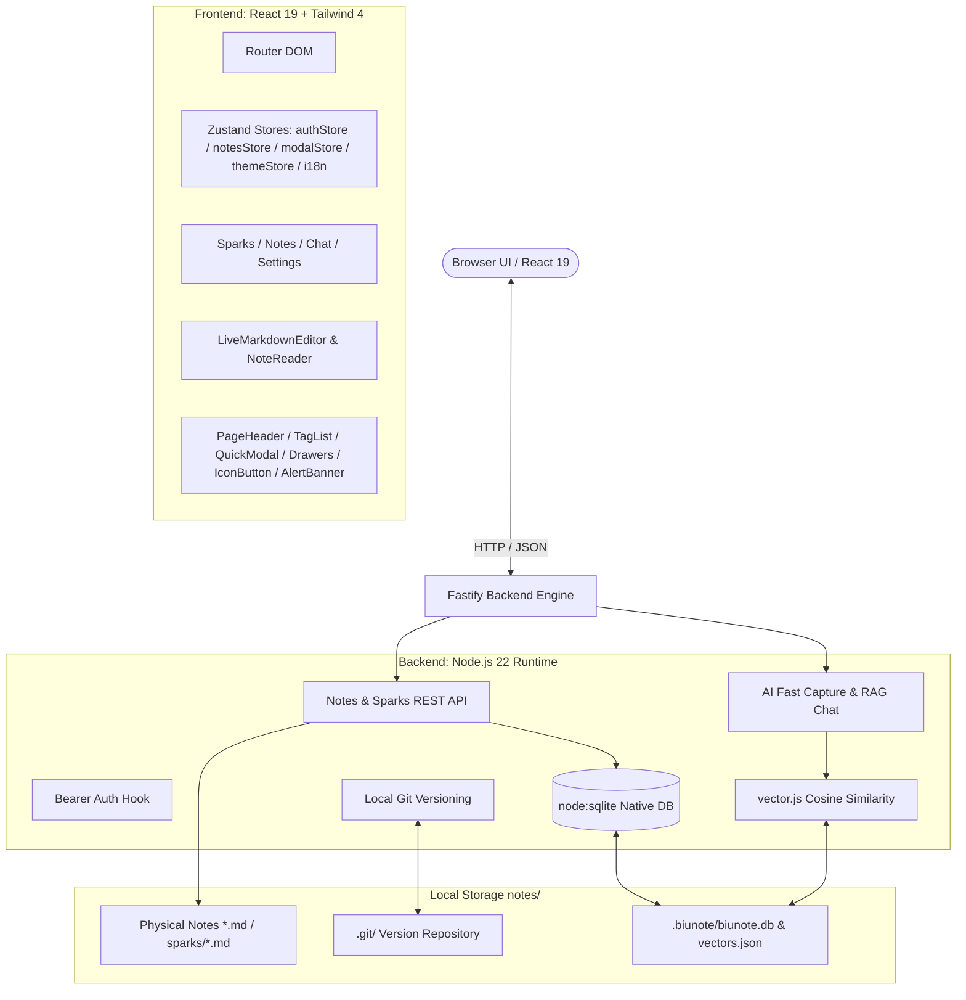

# 🎨 BiuNote System Architecture & Design (DESIGN.md)

## 1. System Overview & Architecture

BiuNote is a minimalist, local-first, AI-native knowledge base built around Markdown-first storage, decoupled SQLite metadata, zero-header UI, and human-in-the-loop AI workflows.



## 2. Layered Storage Model

| Layer | Medium | Location | Role & Lifecycle |
| :--- | :--- | :--- | :--- |
| **Physical Content** | Pure Markdown | `notes/**/*.md`, `notes/sparks/*.md` | 100% pure plaintext without metadata pollution. |
| **Metadata Cache** | SQLite (`DatabaseSync`) | `notes/.biunote/biunote.db` | `filepath`, `hash`, `tags`, `updated_at` for instant query & aggregation. |
| **Vector Index** | JSON Cache | `notes/.biunote/vectors.json` | Document embeddings generated strictly **Just-in-Time (JIT)**. |
| **Version History** | Git Repository | `notes/.git/` | Standalone Git repository initialized for local version tracking. |

## 3. Design System & UI Architecture

### 3.1 Color Semantics & Tokens
- **Dark Mode**: Canvas `#09090b` (`bg-zinc-950`), Cards `#18181b` (`bg-zinc-900`), Border `#27272a` (`border-zinc-800`).
- **Light Mode**: Canvas `#f4f4f6`, Cards `#ffffff`, Border `#d4d4d8` (high-contrast crisp layout).
- **Module Accent Pairing**:
  - ⚡ **AI & System Core**: Emerald (`#10b981`, `primary-emerald` / `emerald`)
  - 💡 **Sparks (灵感)**: Amber (`#f59e0b`, `primary-amber` / `amber`)
  - 📝 **Notes (笔记)**: Blue (`#3b82f6`, `primary-blue` / `blue`)
  - 🤖 **AI Chat (对话)**: Purple (`#a855f7`, `primary-purple` / `purple`)
  - 🚨 **Destructive (危险操作)**: Danger Red (`#ef4444`, `primary-danger` / `danger`)
- **Spacing Tokens**: `--spacing-stream-gap: 0.75rem` (`gap-3`), `--spacing-page-y: 1rem` (`py-4`).
- **Aesthetic**: Zero-shadow flat aesthetic (`shadow-none`) with crisp borders and pure 2D vector logo branding.

### 3.2 Reusable Component Hierarchy (`frontend/src/components/common/`)

| Component | Responsibility & Invariants |
| :--- | :--- |
| **`IconButton`** | Pure minimalist icon button. Zero redundant text labels, zero `title` hover tooltips, micro-press physics (`active:scale-95`), loading indicator support. |
| **`AlertBanner`** | High-contrast notification/warning banner (`warning`, `error`, `info`, `success`) supporting right-side `action` slot for `IconButton`. |
| **`PageHeader`** | Sticky top bar with module badge, title, count badge, optional `onBack` handler, and right-side `actions` slot. |
| **`SearchFilterBar`** | Collapsible search input with tag query support (`#tag`) and clean clear button. |
| **`TagBadge` & `TagList`** | Emerald capsule badges for tags with optional remove button. |
| **`MarkdownViewer`** | Shared high-fidelity Markdown renderer with `marked` renderer-level synchronous syntax highlighting (`highlight.js`) and static copy button markup. 100% shared across mobile reader and PC preview. |
| **`EmptyState`** | Standard placeholder when a collection is empty. |
| **`QuickModal`** | Fast capture & sparks modal (`Ctrl + Enter`) featuring dynamic submit button highlighting and optional `leftAction` slot (e.g. `VoiceInput` button). |
| **`OutlineDrawer`** | Slide-over table of contents drawer for Reader and Editor. Filtered strictly to H1~H3 with clean minimal indentation hierarchy. |
| **`AiModifyDrawer`** | Slide-over AI instruction drawer with preset chips, draft mode detection for empty notes, and reactive submit button. |

### 3.3 Editor, Reader & Preview Architecture
- **Single-Pane Toggle Preview (VS Code Model)**:
  - **New Note (`/notes/new`)**: Starts in **Editor Mode** (`isPreview = false`) with first-line auto-focus.
  - **Existing Note (`/notes/:filepath`)**: Starts in **Preview Mode** (`isPreview = true`) for immersive reading.
  - **Save Transition**: Saving in editor mode automatically transitions to preview mode (`setIsPreview(true)`).
  - **Toggle Control**: `Eye` (Preview) / `Edit3` (Edit) icon button with `Ctrl+P` global shortcut.
- **AST-Synced Outline TOC Engine**:
  - Headings extracted via `marked.lexer` AST parser, strictly ignoring code comments inside fenced code blocks.
  - Deterministic index IDs (`heading-0`, `heading-1`...) ensure 100% match between TOC and rendered DOM.
  - **Dual-mode Smooth Scroll**: Smooth `scrollIntoView` in preview mode, and container-level `scrollTo` with `textarea.focus({ preventScroll: true })` in edit mode (zero instant jumping).
- **Responsive Separation (Mobile vs Desktop)**:
  - **Mobile (< 768px)**: Read-only preview (`NoteReader`), hides manual note creation triggers, intercepts `/notes/new`.
  - **Desktop (>= 768px)**: Direct interactive live Markdown editing and one-click preview toggle.

### 3.4 Button Variant & Hierarchy Specs

```
┌─────────────────────────────────────────────────────────────┐
│ 1. Solid Primary (primary-*, solid high-contrast CTA)       │
│    bg-emerald-600 / bg-amber-500 / bg-blue-600 / bg-red-600 │
├─────────────────────────────────────────────────────────────┤
│ 2. Soft Tint (amber, blue, emerald, danger, purple)        │
│    bg-[color]-500/15 + border-[color]-500/30 (Secondary)    │
├─────────────────────────────────────────────────────────────┤
│ 3. Neutral Default (default)                                │
│    bg-zinc-900/80 + border-zinc-800 + text-zinc-400         │
├─────────────────────────────────────────────────────────────┤
│ 4. Ghost (ghost)                                            │
│    bg-transparent hover:bg-zinc-850/60 (Drawer/Bubble close)│
└─────────────────────────────────────────────────────────────┘
```

- **Size Matrix**:
  - `xs` (24px, `rounded-lg` / `rounded-full`): Card micro-actions, inline tags, SelectionBubble.
  - `sm` (28px, `rounded-xl`): Compact input send buttons.
  - `md` (32px, `rounded-xl` / `rounded-full`): Headers, modals, floating tool pills.
  - `lg` (40px, `rounded-xl`): Full-width login CTA.

### 3.4 Dynamic Interactive Highlighting
Input-driven CTA buttons (`QuickModal`, `AiModifyDrawer`, `ChatPage`, `LoginPage`) remain in a muted inactive state (`bg-zinc-800/80 text-zinc-500 opacity-40`) until valid user input is provided, upon which they immediately light up with vibrant module-accent solid colors and subtle shadows.

### 3.5 Navigation & AI Chat Architecture
- **Floating Pill Navigation**: Rendered on `/sparks`, `/notes`, and `/settings`.
- **Immersive AI Chat Mode (`/chat`)**:
  - The floating pill is hidden and the input bar cleanly adheres to the viewport bottom (`pb-safe`) with an integrated `PageHeader` back handler.
  - **Context Attachment Bar**: Triggered by typing `@` or selecting from the popover. Selected notes/sparks are pinned to a dedicated attachment chip bar (`[📄 Note ×] [💡 Spark ×]`) above the input, supporting keyboard `Backspace` deletion when empty.
  - **Pure Native Textarea**: Dynamic auto-resizing (`max-h-36`) with symmetrical vertical centering for pure, unconstrained text typing (zero contenteditable baseline jitter).
  - **External Metadata Reference Tags**: Referenced documents are rendered externally beneath the user message bubble in subtle, non-intrusive metadata capsules.
  - **Markdown Response Streaming**: Assistant bubbles render with synchronous `MarkdownViewer` syntax highlighting and copy buttons.

### 3.6 Anti-FOUC Architecture
Critical Inline CSS in `index.html` `<head>` sets base theme variables and synchronously evaluates `localStorage.theme` with `@custom-variant dark (&:where(.dark, .dark *));` in `index.css` to eliminate theme flicker regardless of OS preferences.

### 3.7 Lightweight Internationalization Architecture (i18n)
- **Zustand Reactive Store (`frontend/src/i18n/index.js`)**: Manages `language` (`zh` / `en`) state with `localStorage['biunote-language']` persistence and browser locale auto-detection.
- **Concise Dot-Path Resolver (`t(key, params)`)**: Supports nested keys (`common.save`, `notes.deleteConfirm`), parameter interpolation (`{title}`, `{count}`), and deterministic fallback to Chinese (`zh`).
- **Synchronized Dictionaries**: [zh.js](file:///c:/Users/konpm/Documents/mine/biu-note/frontend/src/i18n/locales/zh.js) and [en.js](file:///c:/Users/konpm/Documents/mine/biu-note/frontend/src/i18n/locales/en.js) share 100% identical key tree structure verified by automated unit tests.

## 4. RESTful API Contracts

| Route | Method | Description |
| :--- | :--- | :--- |
| `/api/sparks` | `POST` / `PUT` / `DELETE` | Create, update, or remove spark files in `sparks/`. |
| `/api/notes` | `GET` | List all notes & sparks with SQLite-cached metadata. |
| `/api/notes/raw` | `GET` / `POST` | Fetch raw markdown content or save note (auto-renaming from H1). |
| `/api/notes/delete` | `POST` | Delete physical note and purge SQLite metadata. |
| `/api/notes/import` | `POST` | Batch import `.md` files via multipart upload. |
| `/api/ai/process` | `POST` | Fast capture pipeline: JIT vector sync, similarity retrieval, proposed merge/create diff. |
| `/api/ai/commit` | `POST` | Persist and commit user-confirmed diff to disk. |
| `/api/ai/chat` | `POST` | Multi-document RAG chat over knowledge base with explicit `activeNoteFiles` context synthesis. |

## 5. Security Architecture
- **Path Sanitization**: All file paths validated via `getSafeRelativePath()` against path traversal (`..`, drive letters).
- **Authentication**: Bearer Token middleware protects all `/api/*` endpoints (except `/api/auth/login`).
